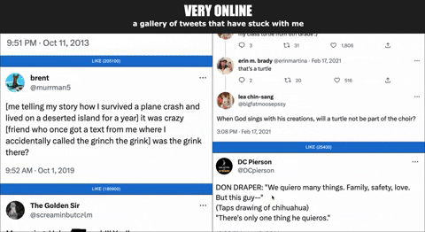

# Very Online: A Gallery of Tweets that have Stuck with Me
Though I don't spend much time on Twitter these days, the site will always have a special place in my heart. A handful of tweets have stuck with me over the years, so I have displayed them in this gallery for my weekend assignment.

## Presentation and Functionality
Tweets are displayed in an image list. Clicking on an image will display a description of why the tweet has stuck with me -- clicking again will hide the description. 

Each image includes a like button. The tweet's like count is displayed in parentheses on the button. Hovering over the like button will add a blue tint to its corresponding tweet, and clicking it will increase the like count for the tweet (only in the gallery -- the actual tweet will be unaffected).
 

 

## Technology
This project is written in Javascript. It uses React, Axios, Postgres, Express, and Material UI.

## How to Use
1. Clone the project repo and open it in VS Code.
2. Run `npm install` to install the required packages from node_modules.
3. Create a Postgres database called "weekend_gallery".
4. Copy the query text in database.sql and paste it into a query in the "weekend_gallery" database.
5. Execute the query to create the "pics" table, then the command to populate it.
6. Open split terminals in VS Code. In the first terminal, run the command `npm run server`.
7. In the second terminal, run the command `npm run client`. 

The app should now be running on localhost:3000.

## Refactoring Goals
This section is for development purposes and is not likely of much interest to outside parties, but I've included it regardless. Please only continue on if it satisfies your own interests.

While I am happy with the state of my project, there is always room for improvement. These are tasks I can tackle when the time comes to build upon this weekend's work.

### Features
This app would benefit from filters. Users could find tweets more easily if they could filter by author name, likes, tags, or even tweets contents. It would also be easier to navigate if the user could sort tweets by likes or author.

It would be nice to let the user decide how many columns should be displayed.

### Style
It would be preferable that images flow from left-to-right, rather than top-to-bottom.

In certain circumstances, the like button for the bottom image of the left column appears at the beginning of the right column. 

The page responds reasonably well to changes in the window size, but some tweaking could be done to refine the app in this regard.

There is generally a bit of white (actually aqua) space at the bottom of the page because the columns are not the same length. It would be ideal if columns were always the same height on the page.

I think it would be more intuitive for tweet descriptions to display via a click listener on an icon button rather than the image itself. The icon button could share a row with the like button or overlay somewhere on the right side of the image.

The current technique for tinting images blue (making the image translucent to let the blue background bleed through) came about as a happy accident when I was trying to lay a translucent blue div over each image. The current technique works, but it would probably be a bit more controlled to make the original plan work.
    I could also probably continue to tint by making the image translucent, but give the container a background color rather than using the background color of the entire page body. I should look into conventions for this sort of styling.

### Readability & Efficiency
I need to add alt text to the images. I realized this omission too late in the weekend to write alt text for each tweet, add it to the database query text, and add the necessary client and server code to incorporate it in the rendered image, but this will be the first update I make when I begin refactoring this project.

The nested ternary operators in the list item component are not the easiest to peruse in their current state. Handling some (or most, or all) of the logic outside of the return statement would probably improve legibility.

JSX elements with multiple properties and children become pretty difficult to display legibly. I should review best practices for this in case there is a more elegant approach than how my code is currently presented.

I currently tint the image blue with two separate listener functions on the like button: onMouseEnter to turn it blue, and onMouseLeave to remove the blue tint. I suspect it would be more elegant to use onHover and a function to toggle the tint, but I got it working as is and I don't see a functional downside to the current approach. No less, this is a change to consider if I am feeling idealistic.

Right now, I suspect my JSON file has users installing quite a bit more of the Material UI package than is really needed. I should see if this is the case, and whether I can cut the fat from this dependency by only installing the MUI components that are actually used in the project.
